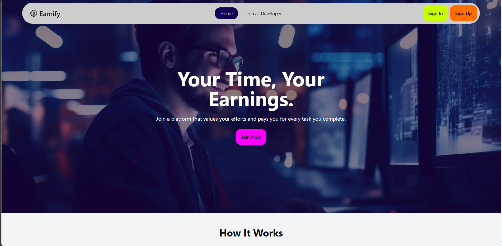

# Earnify

The Micro Tasking and Earning Platform is designed to provide users with opportunities to complete small tasks and earn money. The project uses role based authorization. There are three roles; worker, buyer and admin.

## [Live Link](https://earnify-e4e0e.web.app/).

---

### Category - 19

---

### Features of the website:

- Role Based Authorization.
- Shows toast on any CRUD operation.
- Uses firebase for authentication.
- Navigation is based on role.
- A fully responsive website.
- Shows Notification for the user.
- Show status of activities based on accepted or rejected.
- Able to purchase coin.
- The admin can delete user and all submission or tasks by the user.
- Show overview for different role.

